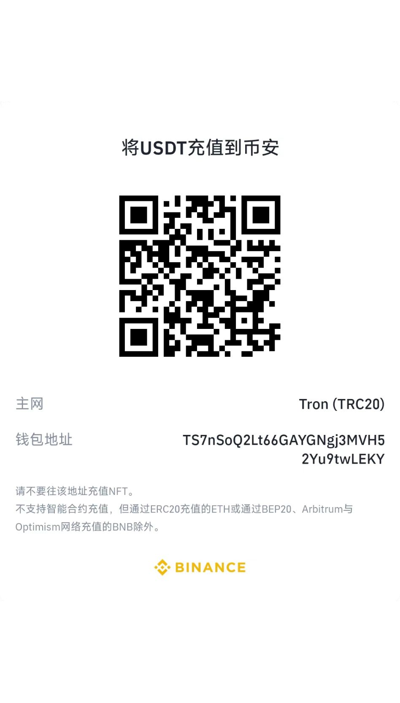

# TokenPayforAcgfaka
<p>
<a href="https://www.gnu.org/licenses/gpl-3.0.html"></a>
<a href="https://www.php.net/releases/7_4_0.php"></a>
<a href="https://github.com/assimon/dujiaoka/releases/tag/1.0.0"></a>
</p>
<h2 align="center">简体中文 | <a href="README_EN.md">English</a></h2>  

## TokenPay - `区块链`支付解决方案

>一款开源的，支持以动态收款地址或静态收款地址收取波场的`TRX`、`USDT-TRC20`以及`ETH系原生币`以及`ETH系ERC20代币`的支付解决方案！ 理论上支持`所有ETH系的区块链`，常见的ETH系的区块链有：`以太坊(ETH)`、`币安智能链(BSC)`、`Polygon`等等。
 
## 项目简介
- `TokenPay`是一个由`C#语言`编写的私有化部署的`区块链`支付解决方案。
- 页面支持以`简体中文`、`英语`、`俄语`显示，依据访问者设备语言自适应，不支持的语言默认显示`英语`
- 本项目不依赖任何外部资源，无需另外部署`数据库`，采用轻量化的`sqlite`，也无需`redis`。
- 任意项目都可以对接，轻松实现`TRX`、`USDT-TRC20`以及`ETH系原生币`以及`ETH系ERC20代币`，理论支持`所有ETH系的区块链`收款！😊 😊 😊
- `TokenPay` 遵守 [GPLv3](https://www.gnu.org/licenses/gpl-3.0.html) 开源协议!

## 项目特点
- `C#语言`跨平台实现，支持x86和arm芯片架构的win/linux/mac设备😁
- 支持每单一个收款地址，或每个用户一个收款地址，解决了单一地址收款，容易导致错误完成订单的痛点。
- 无需额外环境配置，仅运行一个编译后二进制文件即可使用

## 项目结构
```
TokenPay
    ├── Plugs ---> (插件)
    ├── Wiki ---> (知识库）
    └── src ---> (项目核心目录)
```
## 现有插件
- [异次元V3支付插件](Plugs/acgfaka/) | [异次元官网]([https://[https://github.com/lizhipay/acg-faka])
  
## 系统对接
- `TokenPay`接口文档👉🏻[TokenPay接口文档](Wiki/docs.md)
- **也可参考仓库内现有插件**

## 教程：
1、安装dotnet-sdk-8.0.404。下载地址[dotnet-sdk-8.0.404](https://download.visualstudio.microsoft.com/download/pr/ba3a1364-27d8-472e-a33b-5ce0937728aa/6f9495e5a587406c85af6f93b1c89295/dotnet-sdk-8.0.404-win-x64.exe)

2、解压TokenpayForAcgfaka-1.0.zip到硬盘。（建议目录路径为英文）

3、复制EVMChains.Example.json为EVMChains.Example.json，修改为自己的地址；修改appsettings.Example.json为appsettings.json为自己的地址。

4、如果需要启用https访问，修改nginx配置文件nginx-1.27.3\conf\nginx.conf中的ssl部分，打开注释修改为自己的证书路径。建议申请[`gname ssl`证书](https://www.gname.com/register?lang=zhcn&tt=157187&ttbj=)的官方证书，商业版本不贵更加安全。也可以申请免费的[`Lets Encrypt`证书](https://brieflyx.me/2023/linux-tools/certbot/)。

5、双击tokenpay_start.bat运行。

6、验证服务是否正常
6.1 验证tokenpay运行正常
访问http://127.0.0.1:5000


6.2 验证nginx代理正常

（1）访问http://配置ip


（2）访问https://配置ip


## 加入交流/意见反馈
- `TokenPay`频道[https://t.me/TokenPayForAcgfaka](https://t.me/TokenPayForAcgfaka)
- `TokenPay`交流群组[https://t.me/TokenPayForAcgfakaGroup](https://t.me/TokenPayForAcgfakaGroup)

## 设计实现
`TokenPay`的实现方式与其他项目原理类似，都是通过`TronGrid`、`EtherScan`等提供的api，      
轮询订单未过期的钱包地址的`TRX`、`ETH`、`USDT`、`USDC`等入账事件，将入账金额，与数据库的订单金额进行对比，若一致，则视为订单完成
```
简单的原理：
0.服务器定时同步交易所最新汇率
1.客户支付，交易上链
2.服务器定时通过API轮询，获取监听地址下的最新入账交易数据，并与数据库订单对比
3.若金额一致，将订单标记为完成
4.订单完成后，异步通知任务将订单完成事件回调给平台
```

## 打赏
如果该项目对您有所帮助，希望可以请我喝一杯咖啡☕️
```
USDT-TRC20打赏地址: TS7nSoQ2Lt66GAYGNgj3MVH52Yu9twLEKY
```


## 致谢
感谢以下开源项目：

[TokenPay](https://github.com/LightCountry/TokenPay) 

[Serilog](https://github.com/serilog/serilog) 

[FreeSql](https://github.com/dotnetcore/FreeSql) 

[Flurl](https://github.com/tmenier/Flurl) 

[Nethereum](https://github.com/Nethereum/Nethereum) 

[HDWallet](https://github.com/farukterzioglu/HDWallet) 

## 声明
`TokenPay`为开源的产品，仅用于学习交流使用！       
不可用于任何违反中华人民共和国(含台湾省)或使用者所在地区法律法规的用途。           
因为作者即本人仅完成代码的开发和开源活动(开源即任何人都可以下载使用或修改分发)，从未参与用户的任何运营和盈利活动。       
且不知晓用户后续将程序源代码用于何种用途，故用户使用过程中所带来的任何法律责任即由用户自己承担。            
```
！！！Warning！！！
项目中所涉及区块链代币均为学习用途，作者并不赞成区块链所繁衍出代币的金融属性
亦不鼓励和支持任何"挖矿"，"炒币"，"虚拟币ICO"等非法行为
虚拟币市场行为不受监管要求和控制，投资交易需谨慎，仅供学习区块链知识
```
